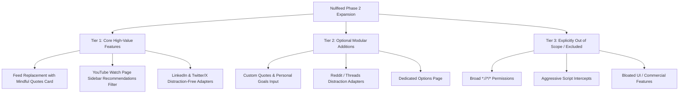

# Nullfeed — PRD: Feed Eradication, Mindful Quotes Replacement & Multi-Platform Expansion
**Prepared for:** Nur Farhad  
**Inspiration Reference:** News Feed Eradicator (3.0.5)  
**Status:** Proposal / Requirements Document (Awaiting User Selection)

---

## 1. Executive Summary & Objective

Nullfeed currently focuses on short-form distraction filtering (Shorts, Reels, Stories, Videos, Ads) on **YouTube**, **Facebook**, and **Instagram**.

The inspiration extension (*News Feed Eradicator*) introduces a complementary paradigm: **Feed Eradication & Replacement**. Rather than leaving empty voids when feeds are hidden, it replaces distracting algorithmic feeds with **mindful, inspiring quotes and focus prompts**, while offering distraction-free controls for platforms like **LinkedIn**, **Twitter/X**, and **Reddit**.

This PRD presents a clean, modular specification for Nullfeed's next phase, structured into clear priority tiers so you can choose exactly what you want and leave out the rest.

---

## 2. Feature Analysis & Comparison

| Feature Capability | News Feed Eradicator (Inspiration) | Nullfeed Current State | Nullfeed Proposed Target |
| :--- | :--- | :--- | :--- |
| **Short-Form Video Blocking** | Basic selector hiding | ✅ Advanced DOM tracking, zero-gap collapse, route blocking | Keep Nullfeed's superior architecture |
| **Feed Replacement / Quotes** | Text replacement in feed container | ❌ Feeds are simply hidden | 💡 **Clean Focus Cards / Minimalist Quotes** |
| **YouTube Granular Controls** | Feed, Shorts, Recommended, Comments | ✅ Shorts shelves, navigation & redirect | 💡 **Add Watch Page Recommended Sidebar toggle** |
| **Platform Support** | 11 platforms (FB, IG, YT, X, LinkedIn, Reddit, etc.) | 3 platforms (YouTube, Facebook, Instagram) | 💡 **Expand selectively (e.g. LinkedIn, Twitter/X)** |
| **Snooze System** | Basic timer | ✅ Multi-duration (`1m`-`24h`) with floating badge | Keep Nullfeed's superior Snooze system |
| **Privacy & Permissions** | Requests broad `*://*/*` permissions | ✅ Strictly scoped host permissions | Keep strict privacy & zero telemetry |

---

## 3. Modular Feature Proposals (Tiered)



---

## Tier 1: Recommended Core Features (High Focus & Polish)

### Feature 1.1: Mindful Quote / Focus Card Feed Replacement
* **What it does:** When an infinite feed (such as YouTube Home, Facebook Newsfeed, or Instagram Feed) is hidden, instead of leaving a black empty void, Nullfeed gracefully places a sleek, dark-themed **Nullfeed Focus Card** featuring a serene motivational quote and author.
* **Key Design:**
  * Clean typography, subtle dark-mode glassmorphic border, and Nullfeed branding.
  * Quotes library curated for focus, deep work, and discipline (e.g., Marcus Aurelius, Seneca, Naval Ravikant, Steve Jobs, Zen proverbs).
  * Smooth refresh button on the card to cycle to another quote on demand.
  * Fully optional: Can be toggled on/off in settings.

### Feature 1.2: YouTube Watch Page Sidebar Recommendations Filter
* **What it does:** Adds a toggle `Hide Recommended Sidebar` for YouTube.
* **Why it matters:** When users watch an educational or intentional video on YouTube, the "Up Next / Recommended Videos" sidebar creates rabbit holes. Hiding `ytd-watch-next-secondary-results-renderer` allows watching intentional videos in peace.
* **Scope:**
  * Toggle: `Hide Recommended Videos` (`youtube.sidebar`).
  * Leaves search, video player, and descriptions untouched.

### Feature 1.3: LinkedIn Distraction-Free Adapter
* **What it does:** Adds **LinkedIn** as a 4th supported platform in Nullfeed.
* **Why it matters:** LinkedIn is essential for professional networking, messaging, job applications, and profile browsing, but its algorithmic main feed and "News Module" sidebar are filled with algorithmic engagement bait.
* **Granular Toggles:**
  * `Hide Main Feed`: Replaces the infinite home feed (`.scaffold-finite-scroll`) with a Focus Quote.
  * `Hide News Sidebar`: Removes trending LinkedIn news and article modules.
  * Leaves Messaging, Notifications, Jobs, Search, and Profiles 100% functional.

### Feature 1.4: Twitter / X Distraction-Free Adapter
* **What it does:** Adds **Twitter/X** as a 5th supported platform.
* **Granular Toggles:**
  * `Hide For You Timeline`: Hides the algorithmic timeline while keeping direct profile links, bookmarks, and lists intact.
  * `Hide Trends / What's Happening`: Removes the right-hand trending topics sidebar (`[aria-label="Timeline: Trending now"]`).
  * Leaves Direct Messages, Notifications, Search, and Profiles 100% functional.

---

## Tier 2: Optional Modular Features (For Your Consideration)

### Feature 2.1: Custom Quotes & Goals Editor
* Allows the user to type their own daily goals, mantras, or custom quotes in the popup, which will appear on the feed replacement cards.

### Feature 2.2: Additional Platforms
* **Reddit:** Hide Home Feed / Popular while keeping search and specific subreddits accessible.
* **GitHub:** Hide dashboard feed activity while keeping repositories and pull requests accessible.

---

## Tier 3: Excluded / Out-of-Scope Items (Anti-Bloat)

* ❌ **No broad `*://*/*` host permissions:** All permissions will stay strictly scoped to the exact domains you enable.
* ❌ **No heavy runtime scripts or network intercepts:** Retain Nullfeed's ultra-fast CSS-first and MutationObserver architecture.
* ❌ **No complex multi-page options menus:** Keep everything inside the intuitive, compact Nullfeed popup.

---

## 4. Technical Architecture & Implementation Plan

### 4.1 Schema Updates (`src/shared/settings.ts`)
```ts
export interface YouTubeSettings {
  shorts: boolean;
  navigation: boolean;
  redirect: boolean;
  sidebar: boolean; // New: Recommended sidebar
}

export interface LinkedInSettings {
  feed: boolean;
  news: boolean;
}

export interface TwitterSettings {
  timeline: boolean;
  trending: boolean;
}

export interface GlobalSettings {
  enabled: boolean;
  showQuotes: boolean; // New: Mindful quote card toggle
}
```

### 4.2 Quote Injector Component (`src/content/quoteCard.ts`)
* Preact-rendered or lightweight vanilla DOM template.
* Injected into the feed anchor (`before` or `replace`) when feed is hidden.
* Auto-cycles or displays randomized quote from `src/shared/quotes.ts`.

---

## 5. Next Steps & Decision Points

Please let me know which features you would like to implement:

1. **Feed Replacement:** Do you want the **Mindful Focus Quote Card** to appear where feeds are hidden, or do you prefer feeds to stay completely blank?
2. **New Platforms:** Would you like to add **LinkedIn** and **Twitter/X**, or keep Nullfeed strictly focused on YouTube, Facebook, and Instagram?
3. **YouTube Watch Page Recommendations:** Should we add the toggle to hide the "Suggested / Recommended Videos" sidebar on YouTube watch pages?
